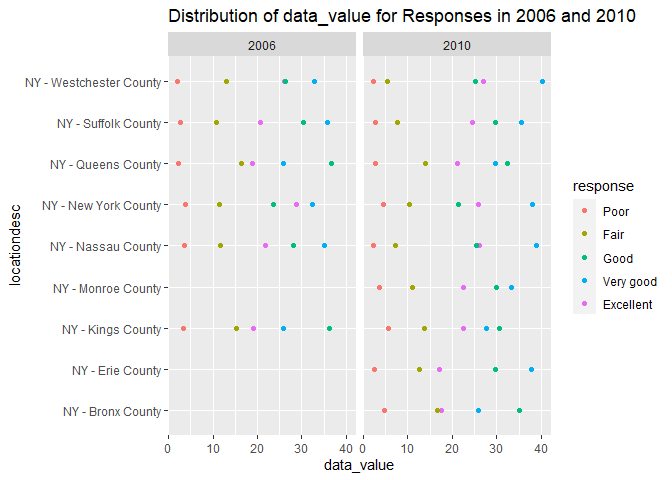

P8105\_hw3\_xh2470
================
Xueqing Huang

# Problem 1

``` r
options(warn = -1)
library(tidyverse)
```

    ## -- Attaching packages --------------------------------------- tidyverse 1.3.1 --

    ## v ggplot2 3.3.5     v purrr   0.3.4
    ## v tibble  3.1.4     v dplyr   1.0.7
    ## v tidyr   1.1.3     v stringr 1.4.0
    ## v readr   2.0.1     v forcats 0.5.1

    ## -- Conflicts ------------------------------------------ tidyverse_conflicts() --
    ## x dplyr::filter() masks stats::filter()
    ## x dplyr::lag()    masks stats::lag()

``` r
library(p8105.datasets)
data("instacart")
```

Write a short description of the dataset.

This dataset contains more than 3 million online grocery orders from
more than 200,000 Instacart users, with **1384617** rows and **15**
columns. Variables contain *order\_id, product\_id,
add\_to\_cart\_order, reordered, user\_id, eval\_set, order\_number,
order\_dow, order\_hour\_of\_day, days\_since\_prior\_order,
product\_name, aisle\_id, department\_id, aisle, department*. Examples
of key observations. are:

| order\_id | product\_id | add\_to\_cart\_order | reordered | user\_id | eval\_set | order\_number | order\_dow | order\_hour\_of\_day |
|----------:|------------:|---------------------:|----------:|---------:|:----------|--------------:|-----------:|---------------------:|
|         1 |       49302 |                    1 |         1 |   112108 | train     |             4 |          4 |                   10 |
|         1 |       11109 |                    2 |         1 |   112108 | train     |             4 |          4 |                   10 |
|         1 |       10246 |                    3 |         0 |   112108 | train     |             4 |          4 |                   10 |
|         1 |       49683 |                    4 |         0 |   112108 | train     |             4 |          4 |                   10 |
|         1 |       43633 |                    5 |         1 |   112108 | train     |             4 |          4 |                   10 |
|         1 |       13176 |                    6 |         0 |   112108 | train     |             4 |          4 |                   10 |

Then, do or answer the following (commenting on the results of each):

1.  How many aisles are there, and which aisles are the most items
    ordered from?

``` r
aisle =
  instacart  %>%  
  group_by(aisle) %>% 
  summarize(n_obs = n()) 
  
aisle_rank = 
  aisle %>% 
  mutate(rank = min_rank(desc(n_obs))) %>% 
  filter(rank == 1)
```

There are **134** aisles and the most items ordered from is **fresh
vegetables**.

2.  Make a plot that shows the number of items ordered in each aisle,
    limiting this to aisles with more than 10000 items ordered. Arrange
    aisles sensibly, and organize your plot so others can read it.

``` r
instacart %>% 
  group_by(aisle) %>% 
  summarize(n_obs = n()) %>%
  filter(n_obs > 10000) %>% 
  ggplot(aes(x = aisle, y = n_obs, color = aisle)) +
  geom_point(alpha = .5) +
  labs(
    title = "Number of items",
    x = "Aisle",
    y = "Numer of items",
    caption = "Only contain aisles with more than 10000 items."
  ) +
  scale_x_discrete(
    label = NULL
  ) 
```

<!-- -->

3.  Make a table showing the three most popular items in each of the
    aisles “baking ingredients”, “dog food care”, and “packaged
    vegetables fruits”. Include the number of times each item is ordered
    in your table.

``` r
instacart  %>%  
  filter(aisle == c("baking ingredients", "dog food care", "packaged vegetables fruits")) %>% 
  group_by(aisle, product_name) %>% 
  summarize(number = n()) %>% 
  mutate(ranking = min_rank(desc(number))) %>% 
  filter(ranking < 4) %>% 
  arrange(aisle, ranking) %>% 
  knitr::kable()
```

    ## `summarise()` has grouped output by 'aisle'. You can override using the `.groups` argument.

| aisle                      | product\_name                                   | number | ranking |
|:---------------------------|:------------------------------------------------|-------:|--------:|
| baking ingredients         | Light Brown Sugar                               |    157 |       1 |
| baking ingredients         | Pure Baking Soda                                |    140 |       2 |
| baking ingredients         | Organic Vanilla Extract                         |    122 |       3 |
| dog food care              | Organix Grain Free Chicken & Vegetable Dog Food |     14 |       1 |
| dog food care              | Organix Chicken & Brown Rice Recipe             |     13 |       2 |
| dog food care              | Original Dry Dog                                |      9 |       3 |
| packaged vegetables fruits | Organic Baby Spinach                            |   3324 |       1 |
| packaged vegetables fruits | Organic Raspberries                             |   1920 |       2 |
| packaged vegetables fruits | Organic Blueberries                             |   1692 |       3 |

4.  Make a table showing the mean hour of the day at which Pink Lady
    Apples and Coffee Ice Cream are ordered on each day of the week;
    format this table for human readers (i.e. produce a 2 x 7 table).

``` r
instacart  %>%  
  filter(product_name == c("Pink Lady Apples", "Coffee Ice Cream")) %>% 
  group_by(product_name, order_dow) %>%
  summarize(
    mean = mean(order_hour_of_day)
  ) %>% 
  mutate(order_dow = recode(order_dow, 
                            `0` = "Sun", 
                            `1` = "Mon",
                            `2` = "Tue",
                            `3` = "Wed",
                            `4` = "Thu",
                            `5` = "Fri",
                            `6` = "Sat")) %>% 
  pivot_wider(
    names_from = order_dow,
    values_from = mean
  ) %>% 
  knitr::kable()
```

    ## `summarise()` has grouped output by 'product_name'. You can override using the `.groups` argument.

| product\_name    |      Sun |      Mon |      Tue |     Wed |      Thu |      Fri |      Sat |
|:-----------------|---------:|---------:|---------:|--------:|---------:|---------:|---------:|
| Coffee Ice Cream | 13.22222 | 15.00000 | 15.33333 | 15.4000 | 15.16667 | 10.33333 | 12.35294 |
| Pink Lady Apples | 12.25000 | 11.67857 | 12.00000 | 13.9375 | 11.90909 | 13.86957 | 11.55556 |

# Problem 2

First, do some data cleaning:

``` r
data("brfss_smart2010") 

brfss_smart2010 = 
  brfss_smart2010 %>% 
  janitor::clean_names() %>% 
  filter(topic == "Overall Health", response == c("Excellent", "Very good", "Good", "Fair", "Poor")) %>% 
  mutate(response = factor(response, levels = c("Poor", "Fair", "Good", "Very good","Excellent" )))
```

Using this dataset, do or answer the following (commenting on the
results of each):

1.  In 2002, which states were observed at 7 or more locations? What
    about in 2010?

``` r
question1 = 
  brfss_smart2010 %>% 
  group_by(year, locationabbr, locationdesc) %>% 
  summarize(n_obs = n_distinct(locationdesc)) %>%
  mutate(n_sum = sum(n_obs))  
```

    ## `summarise()` has grouped output by 'year', 'locationabbr'. You can override using the `.groups` argument.

``` r
# year = 2002
question1 %>% 
  filter(year == 2002, n_sum > 6)  
```

    ## # A tibble: 0 x 5
    ## # Groups:   year, locationabbr [0]
    ## # ... with 5 variables: year <int>, locationabbr <chr>, locationdesc <chr>,
    ## #   n_obs <int>, n_sum <int>

``` r
# year = 2010
question1 %>% 
  filter(year == 2010, n_sum > 6) %>% 
  group_by(locationabbr)
```

    ## # A tibble: 10 x 5
    ## # Groups:   locationabbr [1]
    ##     year locationabbr locationdesc           n_obs n_sum
    ##    <int> <chr>        <chr>                  <int> <int>
    ##  1  2010 FL           FL - Baker County          1    10
    ##  2  2010 FL           FL - Columbia County       1    10
    ##  3  2010 FL           FL - Escambia County       1    10
    ##  4  2010 FL           FL - Gilchrist County      1    10
    ##  5  2010 FL           FL - Hernando County       1    10
    ##  6  2010 FL           FL - Jefferson County      1    10
    ##  7  2010 FL           FL - Miami-Dade County     1    10
    ##  8  2010 FL           FL - Palm Beach County     1    10
    ##  9  2010 FL           FL - Seminole County       1    10
    ## 10  2010 FL           FL - Volusia County        1    10

In 2002, no state was observed at 7 or more locations. In 2010, Florida
was observed at 7 or more locations.

2.  Construct a dataset that is limited to Excellent responses, and
    contains, year, state, and a variable that averages the data\_value
    across locations within a state. Make a “spaghetti” plot of this
    average value over time within a state (that is, make a plot showing
    a line for each state across years – the geom\_line geometry and
    group aesthetic will help).

``` r
question2 = 
  brfss_smart2010 %>% 
  filter(response == "Excellent") %>%
  group_by(year, locationabbr) %>% 
  summarize(
    mean = mean(data_value)
  ) 
```

    ## `summarise()` has grouped output by 'year'. You can override using the `.groups` argument.

``` r
question2
```

    ## # A tibble: 231 x 3
    ## # Groups:   year [9]
    ##     year locationabbr  mean
    ##    <int> <chr>        <dbl>
    ##  1  2002 AR            24.1
    ##  2  2002 DE            22.5
    ##  3  2002 FL            26.8
    ##  4  2002 GA            24.4
    ##  5  2002 IL            18.7
    ##  6  2002 KS            21.6
    ##  7  2002 MA            23.4
    ##  8  2002 MD            20.6
    ##  9  2002 ME            23.8
    ## 10  2002 ND            20.4
    ## # ... with 221 more rows

``` r
question2 %>% 
  group_by(year, locationabbr) %>% 
  ggplot(aes(x = year, y = mean, color = locationabbr)) +
  geom_point(alpha = .5) +
  geom_line() +
  labs(
    title = "Average Value Over Time",
    x = "Year",
    y = "Average Value"
  ) 
```

<!-- -->

3.  Make a two-panel plot showing, for the years 2006, and 2010,
    distribution of data\_value for responses (“Poor” to “Excellent”)
    among locations in NY State.

``` r
brfss_smart2010 %>% 
  filter(year %in% c(2006, 2010), locationabbr == "NY") %>%
  ggplot(aes(x = response, y = data_value, color = year)) + 
  geom_point() +
  facet_grid(. ~ year) +
  labs(
    title = "Distribution of data_value for Responses in 2006 and 2010",
  ) 
```

<!-- -->
