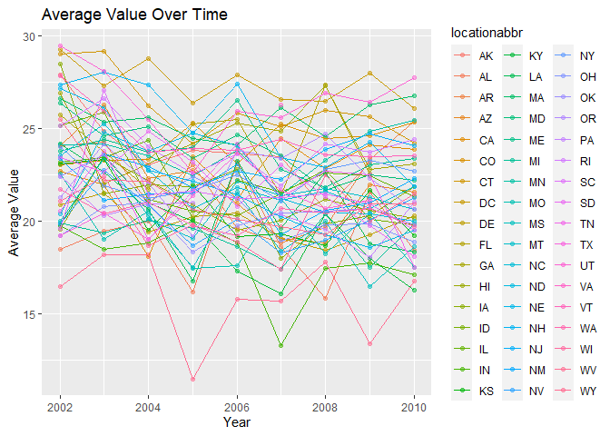
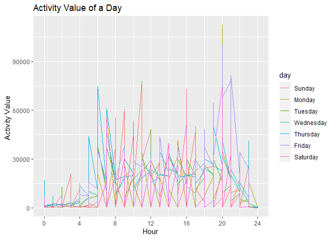

P8105\_hw3\_xh2470
================
Xueqing Huang

# Problem 1

``` r
options(warn = -1)
library(tidyverse)
```

    ## -- Attaching packages --------------------------------------- tidyverse 1.3.1 --

    ## v ggplot2 3.3.5     v purrr   0.3.4
    ## v tibble  3.1.4     v dplyr   1.0.7
    ## v tidyr   1.1.3     v stringr 1.4.0
    ## v readr   2.0.1     v forcats 0.5.1

    ## -- Conflicts ------------------------------------------ tidyverse_conflicts() --
    ## x dplyr::filter() masks stats::filter()
    ## x dplyr::lag()    masks stats::lag()

``` r
library(p8105.datasets)
data("instacart")
```

Write a short description of the dataset.

This dataset contains more than 3 million online grocery orders from
more than 200,000 Instacart users, with **1384617** rows and **15**
columns. Variables contain *order\_id, product\_id,
add\_to\_cart\_order, reordered, user\_id, eval\_set, order\_number,
order\_dow, order\_hour\_of\_day, days\_since\_prior\_order,
product\_name, aisle\_id, department\_id, aisle, department*. Some key
observations are:

| order\_id | product\_id | add\_to\_cart\_order | reordered | user\_id | eval\_set | order\_number | order\_dow | order\_hour\_of\_day | days\_since\_prior\_order | product\_name                                 | aisle\_id | department\_id | aisle                | department   |
|----------:|------------:|---------------------:|----------:|---------:|:----------|--------------:|-----------:|---------------------:|--------------------------:|:----------------------------------------------|----------:|---------------:|:---------------------|:-------------|
|         1 |       49302 |                    1 |         1 |   112108 | train     |             4 |          4 |                   10 |                         9 | Bulgarian Yogurt                              |       120 |             16 | yogurt               | dairy eggs   |
|         1 |       11109 |                    2 |         1 |   112108 | train     |             4 |          4 |                   10 |                         9 | Organic 4% Milk Fat Whole Milk Cottage Cheese |       108 |             16 | other creams cheeses | dairy eggs   |
|         1 |       10246 |                    3 |         0 |   112108 | train     |             4 |          4 |                   10 |                         9 | Organic Celery Hearts                         |        83 |              4 | fresh vegetables     | produce      |
|         1 |       49683 |                    4 |         0 |   112108 | train     |             4 |          4 |                   10 |                         9 | Cucumber Kirby                                |        83 |              4 | fresh vegetables     | produce      |
|         1 |       43633 |                    5 |         1 |   112108 | train     |             4 |          4 |                   10 |                         9 | Lightly Smoked Sardines in Olive Oil          |        95 |             15 | canned meat seafood  | canned goods |
|         1 |       13176 |                    6 |         0 |   112108 | train     |             4 |          4 |                   10 |                         9 | Bag of Organic Bananas                        |        24 |              4 | fresh fruits         | produce      |

Take the first observation as an example. Bulgarian Yogurt which
belonged to the department of dairy eggs was ordered. Also, it gave us
the information of the day of the week and the hour of the day on which
the order was placed.

Then, do or answer the following (commenting on the results of each):

1.  How many aisles are there, and which aisles are the most items
    ordered from?

``` r
aisle =
  instacart  %>%  
  group_by(aisle) %>% 
  summarize(n_obs = n()) 
  
aisle_rank = 
  aisle %>% 
  mutate(rank = min_rank(desc(n_obs))) %>% 
  filter(rank == 1)
```

There are **134** aisles and the most items ordered from is **fresh
vegetables**.

2.  Make a plot that shows the number of items ordered in each aisle,
    limiting this to aisles with more than 10000 items ordered. Arrange
    aisles sensibly, and organize your plot so others can read it.

``` r
instacart %>% 
  group_by(aisle) %>% 
  summarize(n_obs = n()) %>%
  filter(n_obs > 10000) %>% 
  mutate(aisle = fct_reorder(aisle, n_obs)) %>% 
  ggplot(aes(x = n_obs, y = aisle)) +
  geom_point(alpha = .5) +
  labs(
    title = "Number of items ordered in each aisle",
    x = "Numer of items",
    y = "Aisle",
    caption = "Only contain aisles with more than 10000 items."
  ) 
```

<!-- -->

Among aisles contain more than 10000 items, fresh vegetables contains
the most items and butter contains the least items.

3.  Make a table showing the three most popular items in each of the
    aisles “baking ingredients”, “dog food care”, and “packaged
    vegetables fruits”. Include the number of times each item is ordered
    in your table.

``` r
instacart  %>%  
  filter(aisle %in% c("baking ingredients", "dog food care", "packaged vegetables fruits")) %>% 
  group_by(aisle, product_name) %>% 
  summarize(number = n()) %>% 
  mutate(ranking = min_rank(desc(number))) %>% 
  filter(ranking < 4) %>% 
  arrange(aisle, ranking) %>% 
  knitr::kable()
```

    ## `summarise()` has grouped output by 'aisle'. You can override using the `.groups` argument.

| aisle                      | product\_name                                 | number | ranking |
|:---------------------------|:----------------------------------------------|-------:|--------:|
| baking ingredients         | Light Brown Sugar                             |    499 |       1 |
| baking ingredients         | Pure Baking Soda                              |    387 |       2 |
| baking ingredients         | Cane Sugar                                    |    336 |       3 |
| dog food care              | Snack Sticks Chicken & Rice Recipe Dog Treats |     30 |       1 |
| dog food care              | Organix Chicken & Brown Rice Recipe           |     28 |       2 |
| dog food care              | Small Dog Biscuits                            |     26 |       3 |
| packaged vegetables fruits | Organic Baby Spinach                          |   9784 |       1 |
| packaged vegetables fruits | Organic Raspberries                           |   5546 |       2 |
| packaged vegetables fruits | Organic Blueberries                           |   4966 |       3 |

The most popular item in the category of baking ingredients, dog food
care, and packaged vegetables fruits is Light Brown Sugar, Snack Sticks
Chicken & Rice Recipe Dog Treats, and Organic Baby Spinach,
respectively.

4.  Make a table showing the mean hour of the day at which Pink Lady
    Apples and Coffee Ice Cream are ordered on each day of the week;
    format this table for human readers (i.e. produce a 2 x 7 table).

``` r
instacart  %>%  
  filter(product_name %in% c("Pink Lady Apples", "Coffee Ice Cream")) %>% 
  group_by(product_name, order_dow) %>%
  summarize(
    mean = mean(order_hour_of_day)
  ) %>% 
  pivot_wider(
    names_from = order_dow,
    values_from = mean
  ) %>% 
  knitr::kable()
```

    ## `summarise()` has grouped output by 'product_name'. You can override using the `.groups` argument.

| product\_name    |        0 |        1 |        2 |        3 |        4 |        5 |        6 |
|:-----------------|---------:|---------:|---------:|---------:|---------:|---------:|---------:|
| Coffee Ice Cream | 13.77419 | 14.31579 | 15.38095 | 15.31818 | 15.21739 | 12.26316 | 13.83333 |
| Pink Lady Apples | 13.44118 | 11.36000 | 11.70213 | 14.25000 | 11.55172 | 12.78431 | 11.93750 |

Customers who ordered Pink Lady Apples and Coffee Ice Cream prefer to
place their orders in the middle of the day.

# Problem 2

First, do some data cleaning:

``` r
data("brfss_smart2010") 

brfss_smart2010 = 
  brfss_smart2010 %>% 
  janitor::clean_names() %>% 
  filter(topic == "Overall Health", response %in% c("Excellent", "Very good", "Good", "Fair", "Poor")) %>% 
  mutate(response = factor(response, levels = c("Poor", "Fair", "Good", "Very good","Excellent" )))   #organize responses as a factor 

brfss_smart2010
```

    ## # A tibble: 10,625 x 23
    ##     year locationabbr locationdesc  class  topic  question  response sample_size
    ##    <int> <chr>        <chr>         <chr>  <chr>  <chr>     <fct>          <int>
    ##  1  2010 AL           AL - Jeffers~ Healt~ Overa~ How is y~ Excelle~          94
    ##  2  2010 AL           AL - Jeffers~ Healt~ Overa~ How is y~ Very go~         148
    ##  3  2010 AL           AL - Jeffers~ Healt~ Overa~ How is y~ Good             208
    ##  4  2010 AL           AL - Jeffers~ Healt~ Overa~ How is y~ Fair             107
    ##  5  2010 AL           AL - Jeffers~ Healt~ Overa~ How is y~ Poor              45
    ##  6  2010 AL           AL - Mobile ~ Healt~ Overa~ How is y~ Excelle~          91
    ##  7  2010 AL           AL - Mobile ~ Healt~ Overa~ How is y~ Very go~         177
    ##  8  2010 AL           AL - Mobile ~ Healt~ Overa~ How is y~ Good             224
    ##  9  2010 AL           AL - Mobile ~ Healt~ Overa~ How is y~ Fair             120
    ## 10  2010 AL           AL - Mobile ~ Healt~ Overa~ How is y~ Poor              66
    ## # ... with 10,615 more rows, and 15 more variables: data_value <dbl>,
    ## #   confidence_limit_low <dbl>, confidence_limit_high <dbl>,
    ## #   display_order <int>, data_value_unit <chr>, data_value_type <chr>,
    ## #   data_value_footnote_symbol <chr>, data_value_footnote <chr>,
    ## #   data_source <chr>, class_id <chr>, topic_id <chr>, location_id <chr>,
    ## #   question_id <chr>, respid <chr>, geo_location <chr>

Using this dataset, do or answer the following (commenting on the
results of each):

1.  In 2002, which states were observed at 7 or more locations? What
    about in 2010?

``` r
p2_q1 = #problem2_question1
  brfss_smart2010 %>% 
  group_by(year, locationabbr) %>% 
  summarize(n_obs = n_distinct(locationdesc))
```

    ## `summarise()` has grouped output by 'year'. You can override using the `.groups` argument.

``` r
# year = 2002
p2_q1 %>% 
  filter(year == 2002, n_obs > 6) %>% 
  knitr::kable()
```

| year | locationabbr | n\_obs |
|-----:|:-------------|-------:|
| 2002 | CT           |      7 |
| 2002 | FL           |      7 |
| 2002 | MA           |      8 |
| 2002 | NC           |      7 |
| 2002 | NJ           |      8 |
| 2002 | PA           |     10 |

``` r
# year = 2010
p2_q1 %>% 
  filter(year == 2010, n_obs > 6) %>% 
  knitr::kable()
```

| year | locationabbr | n\_obs |
|-----:|:-------------|-------:|
| 2010 | CA           |     12 |
| 2010 | CO           |      7 |
| 2010 | FL           |     41 |
| 2010 | MA           |      9 |
| 2010 | MD           |     12 |
| 2010 | NC           |     12 |
| 2010 | NE           |     10 |
| 2010 | NJ           |     19 |
| 2010 | NY           |      9 |
| 2010 | OH           |      8 |
| 2010 | PA           |      7 |
| 2010 | SC           |      7 |
| 2010 | TX           |     16 |
| 2010 | WA           |     10 |

In 2002, there were **6** states that were observed at 7 or more
locations, which were **CT, FL, MA, NC, NJ, and PA**. In 2010, there
were **14** states that were observed at 7 or more locations, which were
**CA, CO,FL, MA, MD, NC, NE, NJ, NY, OH, PA, SC, TX, and WA**.

2.  Construct a dataset that is limited to Excellent responses, and
    contains, year, state, and a variable that averages the data\_value
    across locations within a state. Make a “spaghetti” plot of this
    average value over time within a state (that is, make a plot showing
    a line for each state across years – the geom\_line geometry and
    group aesthetic will help).

``` r
p2_q2 = # problem2_qustion2
  brfss_smart2010 %>% 
  filter(response == "Excellent") %>%
  group_by(year, locationabbr) %>% 
  summarize(
    mean = mean(data_value)
  ) 
```

    ## `summarise()` has grouped output by 'year'. You can override using the `.groups` argument.

``` r
p2_q2
```

    ## # A tibble: 443 x 3
    ## # Groups:   year [9]
    ##     year locationabbr  mean
    ##    <int> <chr>        <dbl>
    ##  1  2002 AK            27.9
    ##  2  2002 AL            18.5
    ##  3  2002 AR            24.1
    ##  4  2002 AZ            24.1
    ##  5  2002 CA            22.7
    ##  6  2002 CO            23.1
    ##  7  2002 CT            29.1
    ##  8  2002 DC            29.3
    ##  9  2002 DE            20.9
    ## 10  2002 FL            25.7
    ## # ... with 433 more rows

``` r
p2_q2 %>% 
  group_by(year, locationabbr) %>% 
  ggplot(aes(x = year, y = mean, color = locationabbr)) +
  geom_point(alpha = .5) +
  geom_line() +
  labs(
    title = "Average Value Over Time",
    x = "Year",
    y = "Average Value"
  ) 
```

<!-- -->

The distribution of the average value over time within a state is
concentrated.

3.  Make a two-panel plot showing, for the years 2006, and 2010,
    distribution of data\_value for responses (“Poor” to “Excellent”)
    among locations in NY State.

``` r
brfss_smart2010 %>% 
  filter(year %in% c(2006, 2010), locationabbr == "NY") %>%
  ggplot(aes(x = data_value, y = locationdesc, color = response)) + 
  geom_point() +
  facet_grid(. ~ year) +
  labs(
    title = "Distribution of data_value for Responses in 2006 and 2010"
  ) 
```

<!-- -->

Whether in the year of 2006 or 2010, data\_value for responses among
locations in NY State have little difference.

# Problem 3

1.Load, tidy, and otherwise wrangle the data. Your final dataset should
include all originally observed variables and values; have useful
variable names; include a weekday vs weekend variable; and encode data
with reasonable variable classes. Describe the resulting dataset
(e.g. what variables exist, how many observations, etc).

``` r
data = read_csv("./data/accel_data.csv") %>% 
  janitor::clean_names() %>% 
  mutate(weekday_vs_weekend = ifelse(day %in% c("Saturday", "Sunday"), "weekend", "weekday")) %>%      # add weekday_vs_weekend variable
  pivot_longer(
    activity_1:activity_1440,
    names_to = "activity_time",
    values_to = "activity_value"
  ) %>% 
  separate(activity_time, into = c("activity", "minute"), sep = 9) %>%  # simplify activity_time
  select(-activity) 
```

    ## Rows: 35 Columns: 1443

    ## -- Column specification --------------------------------------------------------
    ## Delimiter: ","
    ## chr    (1): day
    ## dbl (1442): week, day_id, activity.1, activity.2, activity.3, activity.4, ac...

    ## 
    ## i Use `spec()` to retrieve the full column specification for this data.
    ## i Specify the column types or set `show_col_types = FALSE` to quiet this message.

``` r
data
```

    ## # A tibble: 50,400 x 6
    ##     week day_id day    weekday_vs_weekend minute activity_value
    ##    <dbl>  <dbl> <chr>  <chr>              <chr>           <dbl>
    ##  1     1      1 Friday weekday            1                88.4
    ##  2     1      1 Friday weekday            2                82.2
    ##  3     1      1 Friday weekday            3                64.4
    ##  4     1      1 Friday weekday            4                70.0
    ##  5     1      1 Friday weekday            5                75.0
    ##  6     1      1 Friday weekday            6                66.3
    ##  7     1      1 Friday weekday            7                53.8
    ##  8     1      1 Friday weekday            8                47.8
    ##  9     1      1 Friday weekday            9                55.5
    ## 10     1      1 Friday weekday            10               43.0
    ## # ... with 50,390 more rows

This dataset collects accelerometer data of a 63 year-old male with BMI
25. It shows the activity value for each minute of a 24-hour day for the
duration of 5 weeks. It contains **50400** rows and **6** columns.
Variables contain *week, day\_id, day, weekday\_vs\_weekend, minute,
activity\_value*.

2.Traditional analyses of accelerometer data focus on the total activity
over the day. Using your tidied dataset, aggregate accross minutes to
create a total activity variable for each day, and create a table
showing these totals. Are any trends apparent?

``` r
p3_q2 =  # Problem3_question2
  data %>% 
  group_by(day_id) %>%
  summarize(total = sum(activity_value)) 

knitr::kable(p3_q2) 
```

| day\_id |     total |
|--------:|----------:|
|       1 | 480542.62 |
|       2 |  78828.07 |
|       3 | 376254.00 |
|       4 | 631105.00 |
|       5 | 355923.64 |
|       6 | 307094.24 |
|       7 | 340115.01 |
|       8 | 568839.00 |
|       9 | 295431.00 |
|      10 | 607175.00 |
|      11 | 422018.00 |
|      12 | 474048.00 |
|      13 | 423245.00 |
|      14 | 440962.00 |
|      15 | 467420.00 |
|      16 | 685910.00 |
|      17 | 382928.00 |
|      18 | 467052.00 |
|      19 | 371230.00 |
|      20 | 381507.00 |
|      21 | 468869.00 |
|      22 | 154049.00 |
|      23 | 409450.00 |
|      24 |   1440.00 |
|      25 | 260617.00 |
|      26 | 340291.00 |
|      27 | 319568.00 |
|      28 | 434460.00 |
|      29 | 620860.00 |
|      30 | 389080.00 |
|      31 |   1440.00 |
|      32 | 138421.00 |
|      33 | 549658.00 |
|      34 | 367824.00 |
|      35 | 445366.00 |

``` r
ggplot(p3_q2, aes(x = day_id, y = total)) +
  geom_point(alpha = .5) +
  geom_line() +
  labs(
    title = "Total Activity Value of Each Day",
    x = "Day",
    y = "Total Activity Value "
  ) +
  scale_x_continuous(
    breaks = c(0,5,10,15,20,25,30,35))
```

<!-- -->

The activity value of this person was fluctuated. In general, he was
more active in the first half of the study than the second half.

3.  Accelerometer data allows the inspection activity over the course of
    the day. Make a single-panel plot that shows the 24-hour activity
    time courses for each day and use color to indicate day of the week.
    Describe in words any patterns or conclusions you can make based on
    this graph.

``` r
data %>% 
  mutate(hour = floor(as.numeric(minute)/60),
         day = factor(day, levels = c("Sunday", "Monday", "Tuesday", "Wednesday", "Thursday", "Friday", "Saturday"))) %>% 
  group_by(day_id, day, hour) %>% 
  summarize(activity_of_hour = sum(activity_value)) %>% 
  ggplot(aes(x = hour , y = activity_of_hour, color = day)) +
  geom_line() + 
  labs(
    title = "Activity Value of a Day",
    x = "Hour",
    y = "Activity Value "
  ) +
  scale_x_continuous(
    breaks = c(0,4,8,12,16,20,24)
    )
```

    ## `summarise()` has grouped output by 'day_id', 'day'. You can override using the `.groups` argument.

<!-- -->

This plot shows the 24-hour activity time courses of this person. From
the plot, we can conclude that this person was more acted at night than
other time on weekday, and more acted in the morning and noon than other
time on weekend.
